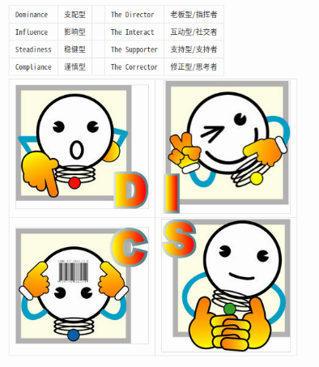

# DISC职业性格测试
***

### 引子
***
* 上周末应朋友之邀，去参加华为内训课，听了半天就领取盒饭溜了。DISC说白了就是企业人力资源用的专业心理测试。和进入大学，入伍的心理测试差不多。前面已经介绍了许多心理学书籍，认真看一本就够了。如果对心理学没兴趣没时间，可以直接做个DISC测试了解一下自己。

### DISC的意义
***
* 性格（心理）测试，如同一般机试的心理测试，这是一种企业判定人格的的重要依据和专业化方法。可以说是人力资源部必备的。
* DISC当然也是我们认识自己的工具
* DISC也可以推荐给身边的人做，当我们对他们有更深了解时，也能减少许多误解。

### 四种类型
***

#### DISC个性测验主要从以下四个主维度特质对个体进行描绘：
#### 支配型（D）
* 一般描述：
* 爱冒险的、有竞争力的、大胆的、直接的、果断的、创新的坚持不懈的、问题解决者、自我激励者。
* 对团队的贡献：
* 基层组织者
* 前瞻性的
* 以挑战为导向
* 发起运动
* 有创新精神
* 压力下的倾向：
* 高要求的
* 紧张的
* 有野心的，好侵略的
* 自负的
* 非日常工作的
* 带有挑战性和机遇的工作
* 理想环境：
* 不受控制、监督和琐碎事困扰
* 革新的、以未来为导向的环境
* 表达思想和观点的论坛或集会
* 可能的缺陷：
* 过度使用地位
* 制定的标准太高
* 缺乏圆滑和变通
* 承担高速、过多的责任
* 高D的情绪特征：愤怒
#### 影响型（I）
* 一般描述：
* 有魅力的、自信的、有说服力的、热情的、鼓舞人心的、乐观的、令人信服的、受欢迎的、好交际的、可信赖的。
* 对团队的贡献：
* 乐观、热情
* 创造性地解决问题
* 激励其他人为组织目标而奋斗
* 团队合作者
* 通过协商缓解冲突
* 理想环境：
* 人们之间密切联系
* 不受控制和琐碎事的困扰
* 有活动的自由
* 有传播思想的论坛或集会
* 有相互联系的民主监督者
* 压力下的倾向：
* 自我提高
* 过分乐观
* 过多的言语
* 不现实的
* 可能的缺陷：
* 不注意细节
* 在评价人方面不现实
* 不加区分地相信人
* 情境下的倾听者
* 高I的情绪特征：乐观
#### 稳健型（S）
* 一般描述：
* 友善的、亲切的、好的倾听者、有耐心的、放松的、热诚的、稳定的、团队合作者、善解人意的、* 稳健的
* 对团队的贡献：
* 可靠的团队合作者
* 为某一领导或某一原因而工作
* 有耐心和同情心
* 逻辑性的思维
* 服务取向
* 理想环境：
* 稳定的、可预测的环境
* 变化较慢的环境
* 长期的团队合作关系
* 人们之间较少冲突
* 不受规则的限制
* 压力下的倾向：
* 非感情表露者
* 漠不关心
* 犹豫不决
* 坚定的
* 可能的缺陷：
* 倾向于避免争论
* 在确定优先权时遇到困难
* 不喜欢非正当的变化
* 高S的情绪特征：非情绪化的
#### 谨慎型（C）
* 一般描述：
* 准确的、有分析力的、谨慎的、谦恭的、善于发现事实、高标准、成熟的、有耐心的、严谨的。
* 对团队的贡献：
* 善于下定义、分类、获得信息并检验
* 客观的、"现实的锚"
* 保持高标准
* 有责任心，稳健可靠
* 综合性的问题解决者小团体的亲密关系
* 相似的工作环境
* 私人办公室或工作环境
* 压力下的倾向：
* 悲观的
* 挑剔的
* 过分批评
* 紧张的、大惊小怪的
* 可能的缺陷：
* 受批评时采取防御措施
* 常陷入细节之中
* 对环境过分热衷
* 似乎有点冷漠和疏远
* 理想环境：
* 需要批判性的思维
* 技术或专业领域

### 特点
* Accuracy－精确性：高 Compliance 和 低 Influence，在分析表中发现显示高服从及低影响的DiSC子特征，并且有时会称为「谨慎」。拥有这种子特征的人非常不喜欢犯错-他们会反复地检查工作，并且会纠正别人工作中的错误，不论别人有没有要他这样做。这种对于确定性的需要表示他们除非万不得已，否则很少愿意冒任何风险。他们在沟通时也是非常谨慎，除了必要的信息外，极少会泄露有关自己的事情。
* Cooperativeness－合作性（配合）：高 Compliance 和 低 Dominance，在分析表中发现显示高服从及低支配的DiSC子特征。这是典型的「墨守成规型」子特征，它所对应的人需要能够绝对确定他们的地位，并且喜欢以既有的规定和程序为架构来支持他们的意见。他们被称为配合型是因为他们在这方面的个人作风常需要主管、同事和友人的实际支持，所以他们会尽量和别人维持有效的工作关系。
* Efficiency－高效性（效率）：高 Dominance 和 低 Influence，在分析表中发现显示高支配及低影响的DiSC子特征。有效率的人是直接而独断，但对个人事务不太关心。他们对事务的看法客观而重分析，并且会不计一切地朝目标迈进。他们需要看见结果，并且会为了追求结果而在品质和细节上妥协。
* Enthusiasm－热情（热忱）：高 Influence 和 低 Steadiness，在分析表中发现显示高影响及低稳健的DiSC子特征。这是一种外向的子特征，与友善有许多相同之处，但是多加了些活力和速度。这种有生命力的作风会在话题中强烈显示他们的兴趣，而他们热情的本性也是对其他人的一种激励因子。
* Friendliness－友好：高 Influence 和 低 Dominance，在分析表中发现显示高影响及低支配的DiSC子特征。「友善」的人喜欢说话沟通是这种类型最强的要素。他们活泼外向，但对于一般的工作不容易专心，而且很容易为了社交机会而分心。
* Independence－独立性：高 Dominance 和 低 Compliance，在分析表中发现显示高支配及低服从的DiSC子特征。这种类型的人通常受挫于原则或规定；他们喜欢依己见行事，并居于权威的地位。这种子特征常见于企业家作风。
* Patience－耐性：高 Steadiness 和 低 Dominance，在分析表中发现显示高稳健及低支配的DiSC子特征。这类型的人的个性不疾不徐，能在别人觉得反复或无聊的情况中工作。他们的作风顺从，相信有些事是他们无法改变的。
* Persistence－执着：高 Steadiness 和 低 Compliance，在分析表中发现显示高稳健及低服从的DISC子特征。有「毅力」的人特别不擅于应付改变。他们一旦适应了现状之后，就很难突破而去适应新的情况。这表示他们会尽一切力量来维持事物的现状，在维护他们的环境和社交圈时，会显示出极大的忠诚和韧性。
* Self-confidence－自信：高 Influence 和 低 Compliance，在分析表中发现显示高影响及低服从的DiSC子特征。「自信」分析表所表示的人极少会缺乏自信，而且几乎在任何社交场合都能处之泰然。他们很容易和陌生人打成一片，也不怕主动与人接触。他们有时会变得过度自信，而造成他们冲动行事。
* Self-motivation－自我激励（自动）：高 Dominance 和 低 Steadiness，在分析表中发现显示高支配及低稳健的DiSC子特征。行动是这个子特征的重要成份。这种类型的人觉得随时都需要活跃，对于不愿或不能跟随他快速步调的人感到不耐。他们对新情势反应快速，但从不会忘记自己的目标与企图。
* Sensitivity－敏感性：高 Compliance 和 低 Steadiness，在分析表中发现显示高服从及低稳健的DiSC子特征。这种类型的人对于周遭环境和其中发生的变化极其敏锐，时常会注意到别人所错过或忽略的细微枝节。它本身是一个正面的因子，但它会让人很容易觉得无聊也很容易分心。
* Thoughtfulness－深思熟虑：高 Steadiness 和 低 Influence，在分析表中发现显示高稳健及低影响的DiSC子特征。「缜密」的人会小心规划他们的用词和行动，而且大都不会鲁奔行事。这类型的人最不擅长处理期限和其它时间方面的限制。他们的优点是工作方面的可靠和稳 [2]  。

### 其它
***
* [DISC_百度百科](https://baike.baidu.com/item/DISC/1586227?fr=aladdin)
* 顺便一提，笔者是SC并高，低D无I。符合精确性，合作性，耐性（心）的特征。
