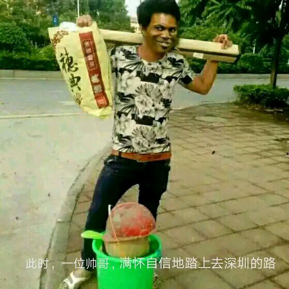
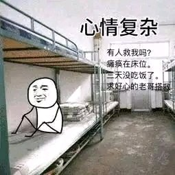
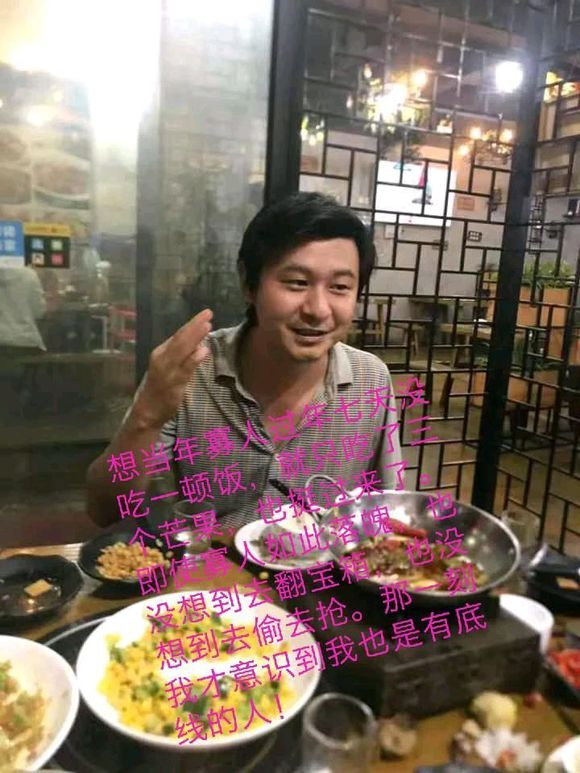

# 三和大神
***

### 引子
***
* 本人在深圳三和附近，第一次了解到三和是在日本NHK关于三和大神的纪录片，深圳也第一次进入我的眼中。大学毕业后，我便落户深圳并在此学习编程，希望以后能当程序员。

### 什么是三和大神？
***
* 三和大神是多是进城打工农民工的后代，他们对父母亲情观念淡泊，也没有学历，他们也没有父辈那样吃苦也要落叶归根的念想，没有人教他们应该怎么做，他们就在大城市中迷失了自我。

* 用大神的名言来说：“做一天阔以玩三天。”他们多从事日结工作。工资在100左右，而后去网吧，吃双丰面馆的挂逼面，喝清蓝大水。

* 三和另一句名言，如同“打工是不可能打工的的”一样火，那就是“兄弟别去，那是黒厂，我们去上网”。反映了三和黑中介黑厂众多的现实。

### 三和大神这个群体形成的原因
***
* 据NHK的记录篇报导，三和大神虽然来历多有不同，但多数是农民工的后代。如同我前面文章提到过的，网络充斥着的北上广深价值观是少数，低学历低收入群体才是主流人口。三和大神们见证了父辈打工一生却一无所有的后果。尽管他们还年轻（非孤寡老人的劳动力），他们选择并非坑蒙拐骗，而是得过且过。他们迫于生计，卖掉微信号和手机，甚至卖掉身份证成为被别人当成公司法人（公司一旦出事，先抓法人），他们能被利用的都利用了，为了活着只能去日结（也做不了 别的工作了）。

### 三和大神们的归宿
* 在NHK的纪录片中，被问道今后生活的宋春江答道：“老了，死了，就死了。”

* 而年轻的冬冬也不知道他今后会怎样。
