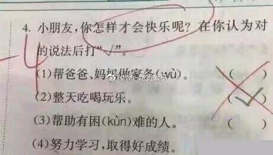

# 我能怎么办？
***

### 引子
***
* 在现今，“寒门再难出贵子”的说法被广泛认可。
* 先富带后富，变成贫富差异加大。富越富，贫永远只是艰难的维持最低生活水准。
* 在阶级固化的情况下，辛苦一年的个体户大半的收入都用来交租，真正的有钱人可以说是躺着就把钱赚了。
* 我一直都很羡慕能到日本留学的人，辛苦大学四年学习不如人家留学生生活中不经意间所学。曾经做过三天日翻，日本的照明监督说:“彭桑，你可以来日本发展啊。”(日本严重少子化，老龄化，而他亲眼见到中国人也并非妖魔鬼怪，也是和他一样活生生的人)我说：“那些去日本的中国留学生更合适。”我日语不够好，而且日本要的是人才，自认非什么人才，再加上高额的生活费，我说这话的强颜欢笑下，他想象不到我有多心痛。像中国这样无门坎，还有5万每年补助，其它相关费用全免，纸面上学伴+3，其实不知道多少人投怀送抱的真是世界上绝无仅有的。（要是白人我还好想点，黑人真接受不了。因为我只讨厌两种人，歧视别人的人和黑人。这是矛盾的，但世界本来就不是非黑即白的）

### 中国实现上升的渠道
***
* 第一就是教育！现在读书无用论很流行，但你见过企业政府招人不带学历门槛的吗？前些天，华为百万招聘博士毕业生。这一点也不稀奇，都说二十一世纪人才最重要。你说，有的人文化没你高却赚钱比你多，确实教育也不是唯一的上升途径。

* 第二就是技术。这不止是单纯的技术性工作，而是你成为任何领域的专家是，就 可以脱贫奔向中产阶级。你可以是医生，律师，建筑工程师，编程工程师，设计师；甚至笔手，画师。任何行业，做到金字塔顶端收入都很高。
* 第三就是做生意。这是最没有门槛，最容易实现的。国家也一直注重扶持小微企业，减少个体户审批手续，鼓励大学生以创业实现就业。但是，市场竞争也非容易的事情，笔者学校有七八家奶茶点，生意好的就只有两三家。人们看到有人赚钱了，跟风去做，却不知任何行业都可能赚，可能亏。这也是十个创业九个死，还有一个吊着一条命。人们不关心失败，只看到某某某创业成功，成功套现几亿实现财务自由。一叶障目，或这说被高额的金钱冲魂了头脑。

### 为何寒门再难出贵子？
***
* 根据上升途径来分析，许多人还认为有钱人都是不学无术，看电视剧开头都是“本故事纯属虚构，如有雷同，实属巧合”，有的人还真把电视当真实。你不努力，你有想过，那些比你有钱却比你人品好更努力的人吗？输在起跑线了，还后知后觉。

* 穷人父母书都贡不起，而有钱人常说要请最好的老师。
* 做生意，你有人脉和门路吗？

### 我该怎么办？
***
* 笔者的一点胡言乱语，笔者自己是不会焦虑的，用一句书名来说：“《长长的路，我慢慢的走》”。笔者只是坚信自己走在正确的道路上而已。

