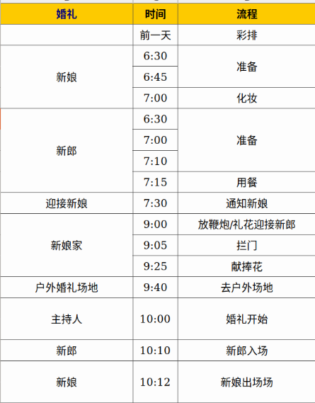

# 情与礼
***

### 引子
***
* 笔者做过三天日翻，日方对国人什么情感都直接表达出来感到很诧异。
* 日本人习惯注重小礼而忘大义，表明礼貌，全是客套，招牌假笑，心底渺渺。
* 国人在文革后，传统受重创后，虽然不想说，流行拜金主义。说好听一点是功利主义，每个人都是精致的利己主义者。
* 福岛核泄漏多大的事，日本国内鞠躬道歉就完了，没处罚一个人。如此严重的认为事故，直到今天福岛核电站排除的污水依然排在太平洋，国际上首先就引起韩国抗议。虽然中国的传统文化断了，当时传统文化有精华也有糟粕，全部摈弃也非全是坏事。

### 中秋的婚礼
***
* 中秋回家参加朋友的婚礼。朋友因为酒店定的双人间，结果酒店明知是婚房还是给出两张单人床的双人间。朋友气得什么话都听不进去了，还好推荐这间酒店的人有经理的电话，骂了经理一顿并扬言不换房间以后不带朋友来了。前台服务员自然不理会顾客，但不能不理会经理，最后成功换房。

* 早在一个月前就自己策划，精心准备，亲自去看场地，定房间。正式婚礼当天，却全都不在乎，比起过往的努力，只想完成这个仪式，因为内心已经满足了。在交换戒指时，状都哭花了。
* 有钱人的婚礼可能很高大上，又时一祝福，又是大摆宴席，最后改离婚还是离婚。同样，亲手布置的婚礼，比起仪式感，更注重心意。花大钱，然后扑克年去参加婚礼还是花小钱高兴的参加婚礼。前者可能物质条件更好，后者一点更幸福。（当然，即有钱又幸福的，我只能说：“你知道有钱人有多么快乐你知道吗？他们的快乐你根本想象不到！”）

### 物欲横流下的余温
***
* 时间倒回十年，流行鸡汤和迷蒙陆什么的田园女权时，鸡汤是物欲横流下社会的慰藉。
* 现在流行毒鸡汤，以前鸡汤的一套骗人效果减弱了。
* 那普天之下，还有人心的净土吗？据我所知，我所在的STEAM单机游戏圈和程序员圈都是有话直说的。

### 圈子
***
* 你是什么样的人，就会被什么样的圈吸引。饭圈也是。
