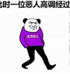

### 全员恶人-记GTA5第三次通关
***

### 全员恶人的由来
***
* “全员恶人”源于日本导演北野武的作品《全员恶人》又名《极恶非道》，是一部没有温度、没有爱、没有兄弟情的黑帮电影，片如其名，全员恶人。全员恶人随着表情包再次火了一把。

### 总结
***
* 片中，极道在警察局门口禁止抽烟的牌子下抽烟。警察与极道不过是伪君子和真小人的区别。本来纲常伦理就是中国古代君王的统治工具，现在推崇的西方契约精神也有《威尼斯商人》胸口取肉的闹剧。
* 没有道德，没有法律。为何注重面子与信用？因为《合作的进化》。这是自然选择的必然结果。个体生存是优胜劣汰，集体必须学会合作。就像所谓公司文化和团队精神。
* 搞清楚上面一点，才能明白。不是被道德或法律绑架，而是出于自身生存或精神上的需要。否则就会被人操控，被灌输思想而不知，如同被西方大肆宣扬的瑞典女孩一样，满是无知与愤世嫉俗。
