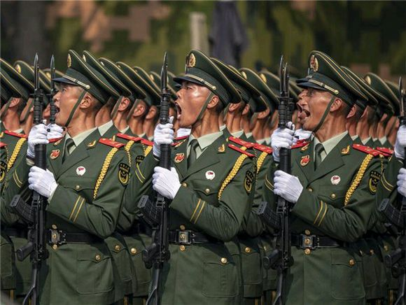

### 风雨70年-庆祝国庆特别篇
***

### 共和国战史
***
* 自1949新中国建国以来，已经过去70年。在这之中，就战争冲突来了解这风雨飘摇的70年。

### 抗美援朝
***
* 自鸦片战争以来，中国一直处于战争之中。太平天国运动，辛亥革命，国民大革命，长征，抗日战争，解放战争。好不容易的和平，而美国空军轰炸东北，陆军也步步紧逼。中国在朝鲜请求下派出志愿军抗美援朝。
* 志愿军在装备劣势，天寒地冻，高山森林中最终促成了停战协定。
* 帝国主义架起大炮轰几下，就会屈辱求和的旧中国一去不复返。
* 弱国无外交。大国和大国摩擦，矛盾没了；大国和小国摩擦，小国没了。伊拉克的萨达姆，利比亚的卡扎菲都是如此，日韩都是美国驻军，武力控制。

### 对印自卫反击站
***
* 中国在朝鲜战场打败了美国为首的联合国军（当时中国席位由蒋介石占据），与帝国主义列强交恶。为打开外交新局面，中国与二战后其他争去独立解放的国家站在一起。
* 英国的麦克马洪线。英国在欧洲有"大陆搅屎棍"之称，因为有英吉利海峡和皇家海军，英国历史上多次联普（德国前身）攻法，联法攻德。使得欧洲大陆战争不断。印度虽然从英国手下独立，但被划分为信仰伊斯兰教的巴基斯坦，和信仰印度教的印度。导致两国直到今天依然在克什米尔地区存在领土争端。英国还在喜马拉雅山脚肥美的藏南地区划了麦克马洪线，将中国领土划给印度。
* 印度在战争初期有迷之自信，可以说一股要打到北京的意淫。但意淫就是意淫，不是真的，在现实战场上甚至出现了解放军一个班俘获印度一个连的战争奇观。用楚云飞的话来说：“就是三万头猪，共军抓三天也抓不完！”战后的印度又十分恐慌，一股保卫首都新德里的迷之恐慌。最终，中国主动让步，希望同为争取民族独立的印度可以改善外交关系。但直到今天，该领土争端仍未得到解决。
* 害人之心不可有，防人之心不可无。

### 对越自卫反击战
***
* 越南前身是解放军一部分，新中国建立后，金正恩（东北抗日联军军长杨靖宇，一师师长金正恩）带朝鲜族战士建立朝鲜。胡志明带领越南人建立越南。
* 但越南在中国帮助下，先后击败法国殖民者和美帝国主义。但越南控制着属于中国的南海岛屿，战争也首先在海上爆发了。1974西沙海战，越南舰艇进犯我国海域，触不及防的中国海军当时还很弱小，越南是大船而我方是小船。正常舰炮对轰，我方必败无疑，因此我方舰艇果断反击，如邓世昌一样撞向敌舰，而后爆发了几百年前，大炮还没搬上船的接舷战。我方将士用步枪打，手榴弹炸。最终，由于我方的奋不畏死的大无畏精神，越南舰艇在吨位优势的情况下落荒而逃。
* 随后陆地的边境冲突也以中方胜利告终。但解放军缴获标这中文的物资时，心里五味杂陈。白养了一条野心狼。
* 没有永远的朋友，没有永恒的敌人，只有永恒的利益。
