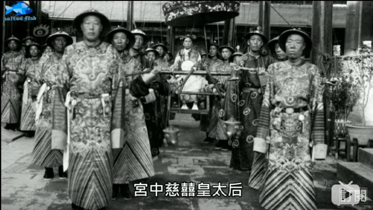
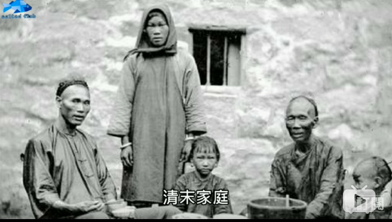
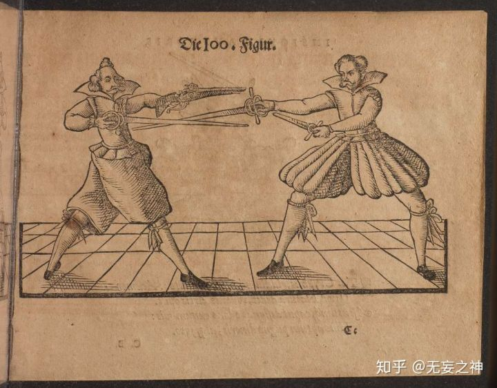

### 李子柒引起的争论
***
* 近期在油管上拥有超过740万粉丝的李子柒引起争议。支持者认为她弘扬中华传统文化并成功实现文化输出，对于接受欧美大片和日本动漫的国人来说有重大意义；反对着认为她弄虚作假，内容不真实，真善美首先要真，真实的农村生活远远没有片中美好惬意。
* 事实上，李子柒虽然表现是农村生活，然而身丝绸，画面美好却省略了背后的苦工。视频几分钟，现实几个月却被忽视了。现在国家推崇汉服，真在古代，都是粗布麻衣，哪有身穿丝绸汉服的平民百姓。可以说，这些都是现代生活给我们带来的便利，真实的古代是大相径庭的。
* [搬运-200张「清朝」珍贵老照片|真实记录了当时情况 落末的大清帝国](https://www.bilibili.com/video/av26384763?from=search&seid=16226126804613930494)

### 大人,时代变了
***

### 《流浪地球》原小说作者刘慈欣谈穿越
***
* 首先穿越是不可能穿越的，就目前已知科学，是不可能回到过去的。但是，抛开这一点不谈，刘慈欣在谈穿越时谈到的一点很有趣。
* 总所周知，古人认为天圆地方，而我们现在直到地球是圆的。地球一边自转一边围绕太阳旋转；因此有了日出日落和四季变化。那这意味着什么呢？刘慈欣说穿越时需要飞船，因为穿越不但是时间上的穿越，也是空间上的穿越，因为穿越时间回到过去，单单时间上还不够，地球是一直在运动的，必须通过飞船来飞回地球。

### “三大件”的变化
***
* 所谓的“三大件”也深刻体现了中国的社会变迁。
* 从最早的“手表、缝纫机、自行车”，到“彩电、冰箱、洗衣机”，再到“电脑、空调、录像机”，最后到现在的“房子，车子，票子”。让人感叹，时代变了，从生活中的实物到人们的思想。
