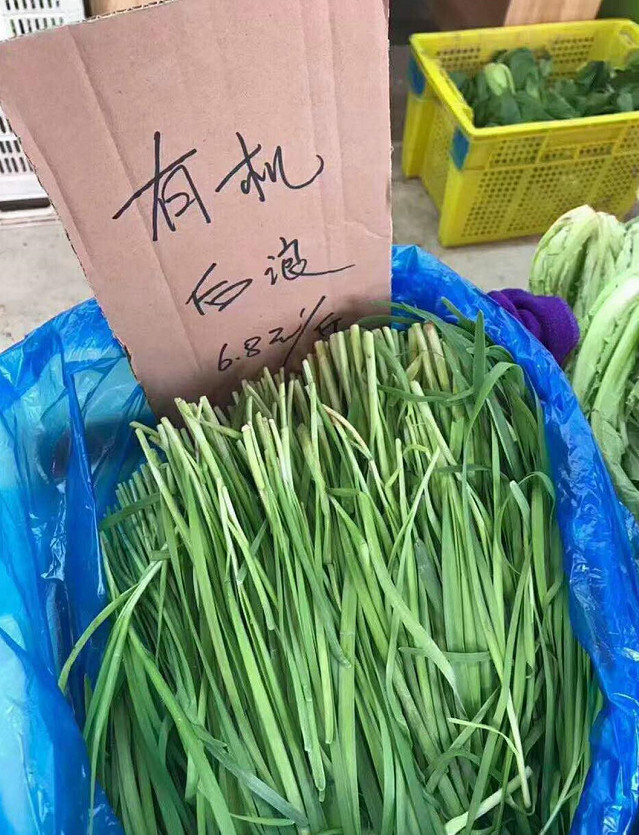
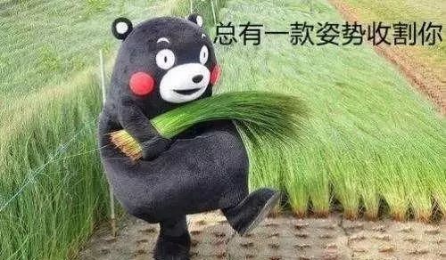

[TOC]

##  有机后浪

###  1. 《后浪》是什么？
+ 《后浪》是biilbili在五四青年节发布的宣传片。
+ 《后浪》是B站进行破圈宣传，在央视播放。
+ 《后浪》播放后引起不小声浪，好在B站控评一绝，视频下清一色好评。

### 2. 《后浪》的真实现状
[或许，这才是大多数普通人的“后浪”](https://www.bilibili.com/video/BV1vz4y1R7u9?from=search&seid=18346066341892875447)
[《非浪》| 朱一旦献给新员工的演讲](https://www.bilibili.com/video/BV1Sf4y1m7Vs?from=search&seid=16027152147811243511)

### 3. 《后浪》为何引起人们讨论？
[《后浪》在知乎好评仅27%](https://www.zhihu.com/topic/21288967/hot)
+ 《后浪》作为B站破圈宣传片，在“C站”播放，请“宋提刑”主持。确实引起广泛讨论和股价上涨，后续控评到位，并及时追加毕业生宣传片《入海》。可以说一手操作十分到位，然而碰瓷五四，宣扬消费主义文化，没有农民，工人，军人的五四宣传片，让深海的众人感到被代表是最大的问题。
+ 什么是五四？
> 五四运动，是1919年5月4日发生在北京的一场以青年学生为主，广大群众、市民、工商人士等阶层共同参与的，通过示威游行、请愿、罢工、暴力对抗政府等多种形式进行的爱国运动，是中国人民彻底的反对帝国主义、封建主义的爱国运动，又称“五四风雷”。

+ 什么是五四精神？
> 五四精神，是指五四运动中的精神，即：忧国忧民、热爱祖国、积极创新、探索科学的爱国主义精神。

+ 然而《后浪》却是占人群极少数的“二代们”的骄奢淫逸。

### 4. 《后浪》到有机后浪
+ 有机后浪如上图，就是韭菜

+ 《后浪》的意义不止于此，因为一个好的问题，好过千万好的答案。标准答案看了，做题还是不会，《后浪》引起的思考，个人的感悟才是切切实实内化为知识，受益终身。